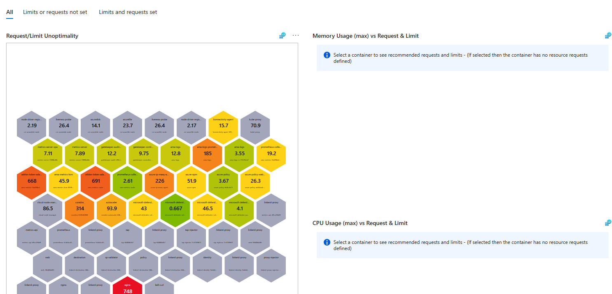
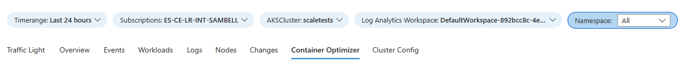
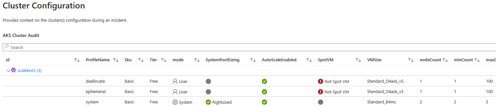

# Azure Kubernetes Service Workbook

## Overview

This repository contains an Azure Workbook which can be used to monitor Azure Kubernetes clusters. This workbook is a work in-progress and is provided as a sample for people to build from.

## Workbook Visual Examples

### Traffic Light

### Failed Events

### Logs

> *Note:* Supports ContainerLogs and ContainerLogsV2

## Container Optimizer

## Workbook Parameters

## AKS Config View

## How To

To use this Workbook you need to:

1. Copy the content from the file `workbook.json`.

2. Open the [Azure Workbook](https://ms.portal.azure.com/#view/Microsoft_Azure_Monitoring/AzureMonitoringBrowseBlade/~/workbooks/menuId/workbooks) page and click `New`.

3. Click on the `code` button.

4. Paste the content copied in step 1 into the page and click `Apply`.

5. Save the Workbook (if you have permissions) and click `Done Editing`.

## To Do

- Optimise queries
- Fix the workload view
- Fix up the cluster autoscaler view and add timeseries

## Contributing

Please feel free to raise a pull request to contribute to this repository, raise an issue or feature request.
## Documentation

- [AKS Troubleshooting Guide](https://learn.microsoft.com/en-us/troubleshoot/azure/azure-kubernetes/welcome-azure-kubernetes)
