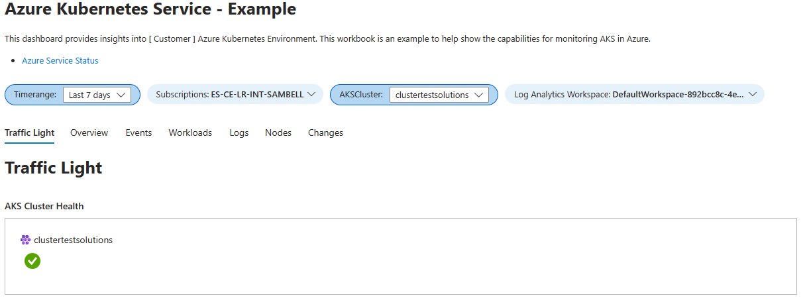
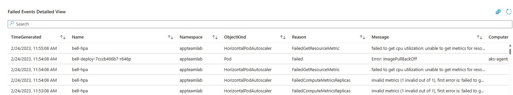
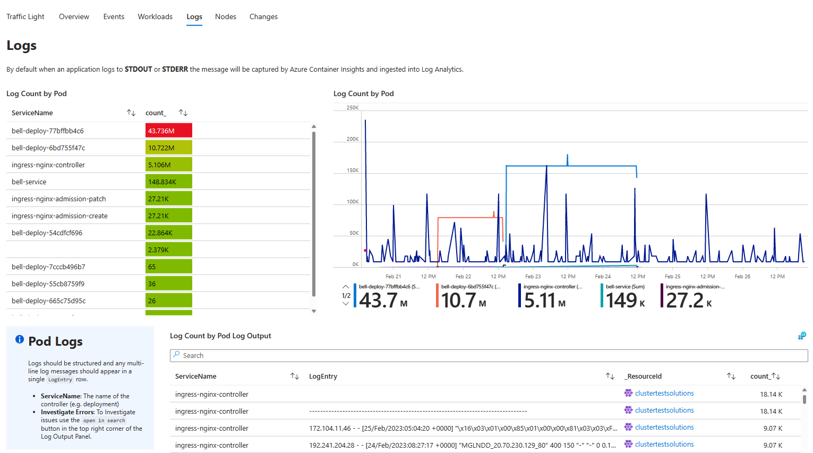

# Azure Kubernetes Service Workbook

## Overview

This repository contains an Azure Workbook which can be used to monitor Azure Kubernetes clusters. This workbook is a work in-progress and is provided as a sample for people to build from.

## Workbook Visual Examples

### Traffic Light

### Failed Events

### Logs

